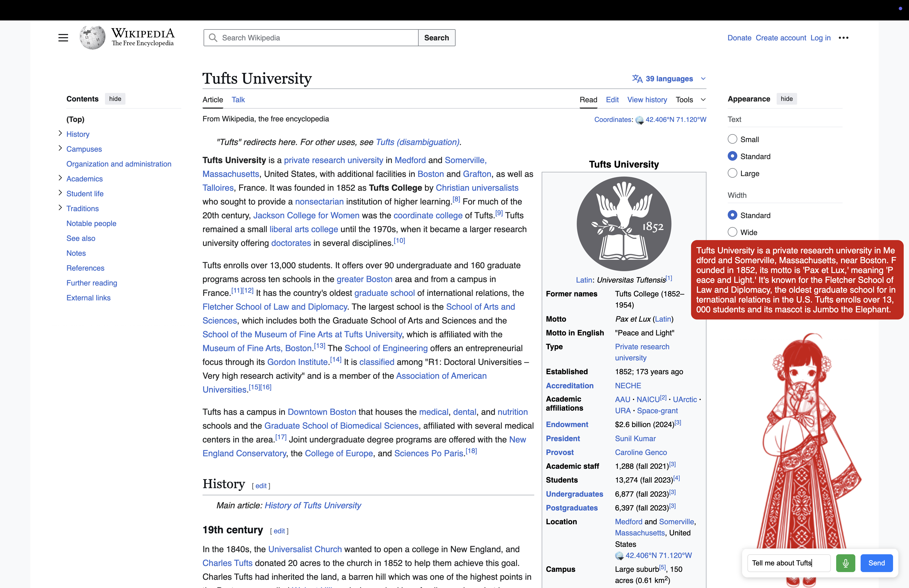

# MITM HTTPS Proxy (libevent + OpenSSL, streaming HTML injection)

This proxy:
- Terminates TLS from the browser using a **dynamically generated certificate** per domain (signed by your local root CA).
- Connects to origins over TLS (client mode).
- **Decodes gzip/brotli** on the fly, **injects** a floating Chatbot badge into `text/html`, removes CSP for reliability, and **re-chunks** to the browser.
- Streams responses; does **not** buffer entire pages.
- Leaves non-HTML content intact (video, audio, JSON, etc.).

> **Use only in a controlled lab environment.** Installing a custom CA and stripping CSP are dangerous if misused.

<div style="text-align: center;">
  <figure>
    
    <figcaption><em>floating Chatbot</em></figcaption>
  </figure>
</div>


## Dependencies

- libevent 2.x (`libevent` and `libevent-openssl`)
- OpenSSL (1.1 or 3.x)
- zlib
- brotli decoder (`libbrotlidec`)
- A C11-ish compiler (gcc/clang)

On Ubuntu/Debian:
```bash
sudo apt-get install -y build-essential \
  libevent-dev libssl-dev zlib1g-dev libbrotli-dev
````

On macOS (Homebrew):

```bash
brew install openssl@3 brotli libevent
# If needed, set PKG_CONFIG_PATH to point to openssl@3
export PKG_CONFIG_PATH="$(brew --prefix openssl@3)/lib/pkgconfig:${PKG_CONFIG_PATH}"
```

## Setup

```bash
# 1) Create a local CA
./generate_ca.sh

# 2) Build
make

# 3) Import ./ca/ca.crt into your browser trust store
#    (or for curl, pass --cacert ca/ca.crt)

# 4) Run the proxy (listens on 0.0.0.0:8080)
./proxy
```

Configure your browser/system to use HTTP proxy `127.0.0.1:8080`.

### Quick curls

Plain HTTP:

```bash
curl -v -x http://127.0.0.1:8080 http://example.com/
```

HTTPS (with our CA):

```bash
curl -v -x http://127.0.0.1:8080 --cacert ca/ca.crt https://example.com/
```

## How the injection works

* For `text/html`, the proxy will:

  1. Parse/stream response headers from origin.
  2. Decode `Transfer-Encoding: chunked` if present.
  3. Decode `Content-Encoding: gzip` or `br` if present (zlib/brotli).
  4. **Remove CSP** headers if modifying (so the injected badge is visible everywhere).
  5. Remove `Content-Length` and send back to the browser as **chunked**.
  6. Stream bytes; when `</body>` is observed (case-insensitive), inject the badge. If not found by end, inject right before EOF.

* For non-HTML or no body (e.g., 204/304, HEAD, Upgrade), the proxy forwards unchanged.


## Notes

* Upstream ALPN is forced to `http/1.1` to keep parsing straightforward.
* The proxy **removes `Accept-Encoding`** in client requests to encourage identity responses, but **still handles** servers that compress anyway.


## Why this works

* The main HTML shell of YouTube arrives with **`Content-Encoding: br` (Brotli)**. This proxy **decodes brotli** (via `libbrotlidec`) on the fly, injects the badge, strips CSP (for reliability), removes `Content-Encoding` and `Content-Length`, and **streams it back chunked**.
* Video/audio/media/XHR/JSON responses are not `text/html`, so they are **forwarded unchanged**.
* For servers that still send gzip/deflate: we **zlib-decode**.
* For servers that honor `Accept-Encoding: identity`, we inject without decoding (still streamed & chunked).
* If the page **doesn’t contain `</body>`**, we **inject at end‑of‑stream** so you still get the badge.
